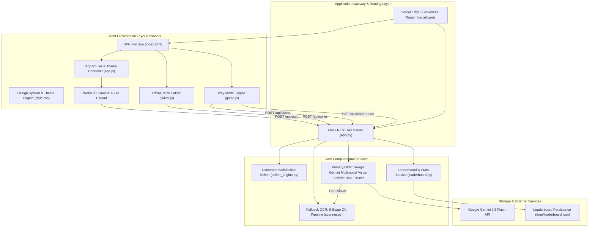

# 🏗️ Sudoku Arena: System Architecture & Technical Specifications

> **Academic & Engineering Capstone Documentation**  
> **Project Name:** Sudoku Arena — Intelligent Playable Engine, Multimodal AI Vision & Constraint Solver  
> **Technology Stack:** Python 3.8+ (Flask), Google Gemini 2.5 Flash API, OpenCV, HTML5 / CSS3 / ES6+ JavaScript, WebRTC MediaStreams API

---

## 1. Directory Structure

```text
sudoku-solver/
│
├── app.py                          # Primary Flask Application & API Gateway (WSGI entrypoint)
├── requirements.txt                # Python backend dependencies (Flask, OpenCV, google-genai)
├── vercel.json                     # Vercel Serverless & Static Edge routing configuration
├── README.md                       # Repository overview and setup guide
├── PROJECT_DOCUMENTATION.md        # Comprehensive academic technical report (500+ lines)
├── PROJECT_ARCHITECTURE.md         # Architecture diagrams, file structure & system design
├── .env.example                    # Environment configuration template (API keys, ports)
├── .gitignore                      # Git tracking exclusion list
│
├── index.html                      # Single Page Application (SPA) structure:
│                                   #   ├── View 1: Home / Landing Dashboard & Feature Cards
│                                   #   ├── View 2: Play Sudoku Arena (Responsive Game Engine)
│                                   #   ├── View 3: Sudoku Scanner & Solver (Manual, Camera, Upload)
│                                   #   ├── View 4: Player Statistics & Win-Rate Analytics
│                                   #   ├── View 5: Global Leaderboard & Difficulty Filter
│                                   #   └── View 6: How-to-Play Interactive Guide
│
├── assets/                         # Static Frontend Assets
│   ├── css/
│   │   └── style.css               # Unified Design System: tokens, dark/light themes,
│   │                               # 2-column desktop grid & zero-scroll mobile layout
│   └── js/
│       ├── app.js                  # Global UI router, theme manager, scanner modals, camera stream
│       ├── game.js                 # Sudoku Arena Play Engine (generation, drag-and-drop,
│       │                           # dynamic keypad, mistake tracking, timer, undo/redo stack)
│       └── solver.js               # Offline client-side constraint propagation MRV solver (<15ms)
│
└── backend/                        # Modular Server-Side Processing Packages
    ├── __init__.py                 # Package declaration
    ├── solver_engine.py            # Rigorous constraint satisfaction solver with uniqueness test
    ├── gemini_scanner.py           # Primary OCR: Google Gemini 2.5 Flash Multimodal Vision AI
    ├── scanner.py                  # Fallback OCR: 8-stage OpenCV Computer Vision pipeline
    ├── leaderboard.py              # Leaderboard persistence manager (Vercel /tmp & local storage)
    ├── data/
    │   └── leaderboard.json        # Persistent scores and player statistics registry
    └── digit_templates/           # 72+ pre-normalized binary templates (1–9) for OpenCV matching
```

---

## 2. High-Level Architectural Diagram



---

## 3. Subsystem Breakdown & Architecture Layers

### Layer 1: Presentation & Client-Side Engine (Frontend)
* **Single Page Application (`index.html`)**: Tab-based zero-refresh architecture serving 6 views (`Home`, `Play`, `Solver`, `Stats`, `Scores`, `Guide`) with accessible modal dialogues for camera capture and scan verification.
* **Responsive Multi-Viewport Layout (`style.css`)**:
  * **Desktop (`≥ 860px`)**: Two-column layout pairing a 460px board with an aligned 380px control sidebar (Mistakes, Timer, Pause, full-width difficulty selector, 5-action toolbar, and 3×3 ergonomic keypad).
  * **Mobile (`≤ 768px`)**: Immersive zero-scroll layout. Website navbar auto-hides during play; includes an in-game header bar (`◄ Back`, centered digital timer, `Pause`), viewport-scaled board (`calc(100vh - 235px)`), and a single horizontal row of 9 number buttons.
* **Game Subsystem (`assets/js/game.js`)**:
  * **Board Generation**: Las Vegas seed generation with unique-solution backtracking verification.
  * **Pointer Event Drag-and-Drop**: Unified touch/mouse drag-and-drop with floating ghost and target highlighting.
  * **Dynamic Numpad Exhaustion**: Automatically tracks remaining occurrences of each number (1–9) against the ground truth.
  * **Command Pattern Undo/Redo**: Full state stack allowing players to revert and replay moves.
* **Offline Client Solver (`assets/js/solver.js`)**:
  * Pure JavaScript implementation of Minimum Remaining Values (MRV) backtracking with constraint propagation. Runs completely offline in $<15\text{ ms}$.

---

### Layer 2: API Gateway & Application Server (Backend)
* **Flask Application (`app.py`)**:
  * Acts as the centralized RESTful API controller.
  * Provides cross-origin resource sharing (CORS), input sanitization, and structured JSON responses.
  * Serves both static frontend assets (for local execution) and serverless endpoints (for Vercel).

#### Key API Endpoints:
| Method | Endpoint | Description |
| :--- | :--- | :--- |
| `POST` | `/api/solve` | Validates input grid and computes solution with uniqueness detection. |
| `POST` | `/api/scan` | Ingests image (file/base64) and parses digits using the dual OCR pipeline. |
| `POST` | `/api/score` | Records game completion metrics (time, difficulty, hints, mistakes). |
| `GET` | `/api/leaderboard` | Retrieves top global player records filtered by difficulty tier. |
| `GET` | `/api/health` | Diagnostic endpoint reporting API status and available vision engines. |

---

### Layer 3: Dual-Engine Optical Recognition (Computer Vision)
1. **Primary Engine — Google Gemini 2.5 Flash Multimodal Vision (`backend/gemini_scanner.py`)**:
   * Uses generative multimodal reasoning to parse board orientation, cell boundaries, and digits simultaneously.
   * High accuracy across camera glare, perspective distortions, shadows, and handwritten numbers.
2. **Fallback Engine — Classical OpenCV Pipeline (`backend/scanner.py`)**:
   * 100% offline fallback when API limits or network outages occur.
   * **8-Stage Computer Vision Pipeline**:
     1. Grayscale conversion & Gaussian blur ($\sigma=1.2$).
     2. Adaptive Gaussian thresholding.
     3. Morphological dilation & largest 4-vertex contour discovery.
     4. Perspective transformation (homography matrix projection to $450 \times 450\text{ px}$).
     5. 9×9 cell grid segmentation ($50 \times 50\text{ px}$ per cell).
     6. Margin cropping ($14\%$) to remove grid lines.
     7. Bounding box discovery and aspect-ratio noise rejection.
     8. Multi-scale Normalized Cross-Correlation (NCC) template matching against 72 pre-computed binary templates.

---

### Layer 4: Mathematical Solver & Uniqueness Engine (`backend/solver_engine.py`)
* **Constraint Satisfaction Formulation (CSP)**:
  * 81 variables ($X_{r,c} \in \{1 \dots 9\}$) governed by 27 distinct `all-different` constraints across rows, columns, and 3×3 blocks.
* **Backtracking with MRV Heuristic**:
  * Evaluates the cell with the Minimum Remaining Values (fewest legal candidates) first, minimizing the branching factor.
* **Uniqueness Detection**:
  * Continues search after finding the first solution to check for alternate branch paths, formally identifying whether the puzzle has a unique solution, multiple solutions, or no valid solution.

---

### Layer 5: Data Persistence & Cloud Deployment
* **Data Storage (`backend/leaderboard.py`)**:
  * Dual-mode file-safe persistence: writes to local `backend/data/leaderboard.json` during desktop runs, and switches automatically to `/tmp/leaderboard.json` in serverless cloud environments (Vercel).
* **Cloud Deployment (`vercel.json`)**:
  * Configured for edge static serving of HTML/CSS/JS with zero cold starts.
  * Serverless Python bridge routing `/api/*` requests to `app.py`.
